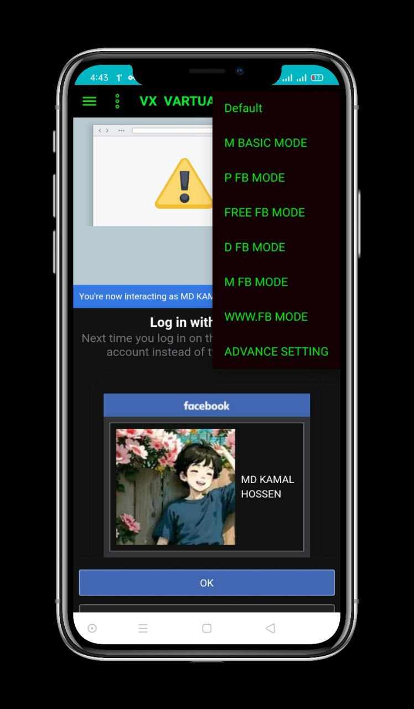
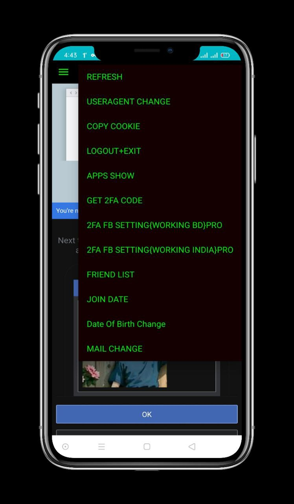

<h1 align=center>Team X Fire</h1>

# VX-FB-INSTRAGRAM-TOOL 
Remember :- This App Made For Educational Purpose Only. Don't Use Any Iligel Activity And Don't Harm Anyone. Team X Fire will not be responsible if you use it for any unethical activity.

## Features

 - NO LOCK FB ID 
 - Easy to use 
 - 80% CP BYPAAS
 - EXTRACT FB ID COPY
 - CUSTOM USER AGENT CHANGE
 - EXTRACT INSTAGRAM COOKIE
 - NO VIRUS IN APP

## Requirements
 - Android Phone
 - Version 6.0+
 
 ## DOWNLOAD
 <a href="https://github.com/teamxfire/VX-FB-INSTRAGRAM-TOOL/raw/main/VX%20SOCIAL%20TOOL.apk">DOWNLOAD</a>

## DISCLAIMER

 TO BE USED FOR EDUCATIONAL PURPOSES ONLY

The use of the FB INS Tool is COMPLETE RESPONSIBILITY of the END-USER. Developers assume NO liability and are NOT responsible for any misuse or damage caused by this program..

